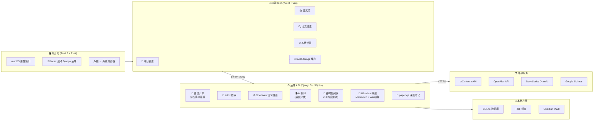

# LitRadar 架构图绘制提示词

## 图类型

技术架构图（分层架构 + 数据流），横向布局，适合 PPT 16:9 宽屏展示。

## 风格规范

- **配色**：深色背景（#1a1a2e 或 #0f0f1a），组件用低饱和度色块
  - 用户层（桌面）：#7c3aed（紫色，LitRadar 品牌色）
  - 前端层：#a855f7（浅紫）
  - 后端层：#3b82f6（蓝色）
  - 外部服务层：#10b981（绿色）
  - 存储/数据层：#f59e0b（琥珀色）
  - 数据流箭头：白色半透明，带标签
- **字体**：标题用粗体白色，说明文字用灰色（#94a3b8），字号清晰可读
- **形状**：圆角矩形（border-radius: 12-16px），组件之间用实线箭头连接注明数据流向
- **整体氛围**：科技感、干净、适合技术分享和项目展示

---

## 图层结构（从上到下 / 从左到右均可，推荐左→右布局）

### 第 1 层：用户 / 桌面壳（最左侧）

**组件**：Tauri 2 Desktop Shell (Rust)

**子组件**：
- macOS 原生窗口
- Sidecar 进程管理（启动 Django 后端）
- 外链拦截 → 系统浏览器打开
- 端口 18765（生产）/ 8765（开发）

**说明文字**：桌面壳 · Rust · 进程管理 · 原生体验

---

### 第 2 层：前端 SPA（中左）

**组件**：Vue 3 + TypeScript + Vite

**子组件（四个 Tab 页签，横向排列）**：
1. 今日雷达（配置关键词、每日推荐）
2. 论文库（收藏管理、详情预览、PDF 阅读）
3. 论文搜索（arXiv 检索、OpenAlex 推荐）
4. 本地设置（AI 接口、Obsidian 路径）

**底部功能横条**：
- 中文翻译（后台异步）
- localStorage 缓存
- AI 连接测试

**说明文字**：单文件 SPA · Tab 式导航 · TypeScript · Vitest

---

### 第 3 层：后端 API（中右）

**组件**：Django 5 + Django REST Framework

**子组件（纵向排列）**：

| 模块 | 说明 |
|------|------|
| 雷达引擎 | 多查询组 arXiv 检索 → 去重 → 关键词匹配+时效评分 → 加权随机推荐 |
| 搜索服务 | arXiv Atom API + OpenAlex 语义搜索，近两年过滤 |
| AI 翻译 | OpenAI 兼容接口，批量和单个翻译 |
| 结构化阅读 | 10 维度论文解析（方向、任务、网络、创新点…） |
| Obsidian 导出 | Markdown + Wiki 链接 + frontmatter，自动写入用户 Vault |
| paper-qa | PDF 全文索引 + 结构化提问生成深度笔记 |
| 本地设置 | AI 接口配置、模型管理、数据库 CRUD |

**说明文字**：Python · SQLite · 单文件架构 · CSRF Exempt · pytest

---

### 第 4 层：外部服务（最右侧）

**组件（纵向排列）**：

1. **arXiv API** — `export.arxiv.org`，Atom XML 检索，论文元数据获取
2. **OpenAlex API** — `api.openalex.org`，语义搜索，工作发现与推荐
3. **AI LLM** — DeepSeek / OpenAI，翻译、结构化阅读、笔记生成
4. **Google Scholar** — 论文引用链接生成

**说明文字**：外部 API · HTTPS

---

### 第 5 层：本地存储（最底部横跨）

**组件**：
- **SQLite** — Django ORM，论文库、研究方向、用户设置
- **本地 PDF 缓存** — `.cache/papers/`，避免重复下载
- **localStorage** — 雷达推荐缓存、OpenAlex 发现缓存、UI 偏好
- **Obsidian Vault** — 本地 Markdown 知识库，双向链接

**说明文字**：本地优先 · 离线可用 · 数据隐私

---

## 数据流箭头（标注关键交互）

1. **用户 → 前端**：点击 / 输入 / 配置
2. **前端 → 后端**：HTTP REST JSON（fetch API）
3. **后端 → arXiv / OpenAlex**：HTTPS 检索论文
4. **arXiv / OpenAlex → 后端**：返回论文元数据（标题、摘要、作者等）
5. **后端 → AI LLM**：发送论文数据，请求翻译 / 结构化分析
6. **AI LLM → 后端**：返回翻译结果 / 结构化阅读结果
7. **后端 → SQLite**：读写论文、设置、推荐记录
8. **后端 → Obsidian Vault**：写入 Markdown 文件 + Wiki 链接
9. **前端 → localStorage**：读写缓存（雷达、发现、UI 状态）

---

## 标题 / 图例

- **图标题**（顶部居中）：**LitRadar 系统架构图**
- **副标题**：AI 驱动的个人文献雷达 — Django + Vue + Tauri 全栈桌面应用
- **图例**（右下角小字）：紫色 = 前端与桌面 | 蓝色 = 后端服务 | 绿色 = 外部 API | 琥珀色 = 本地存储

---

## 绘图工具建议

- **Excalidraw**：手绘风格，适合快速草图
- **draw.io / diagrams.net**：精确布局，导出 SVG/PNG
- **Figma**：高质量设计，方便后续调整
- **Mermaid**：代码生成，适合嵌入 README（下面附 Mermaid 代码）

---

## 附录：Mermaid 代码（可直接渲染）

